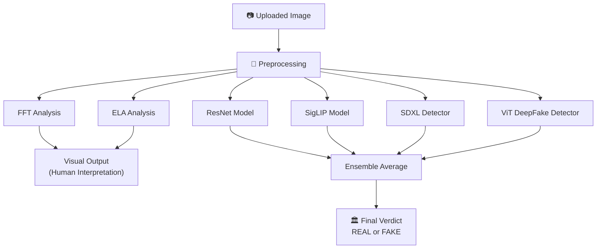
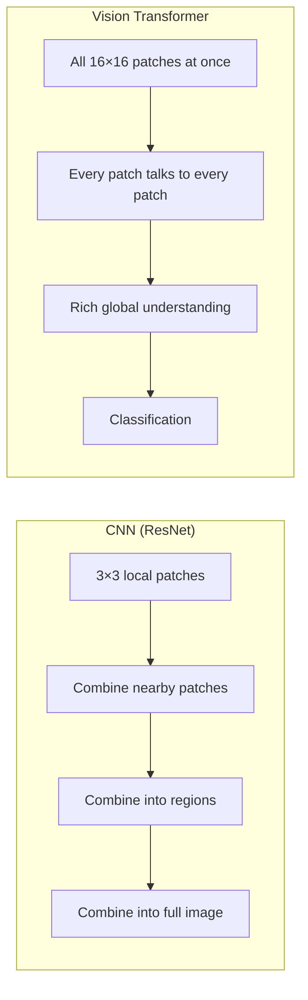
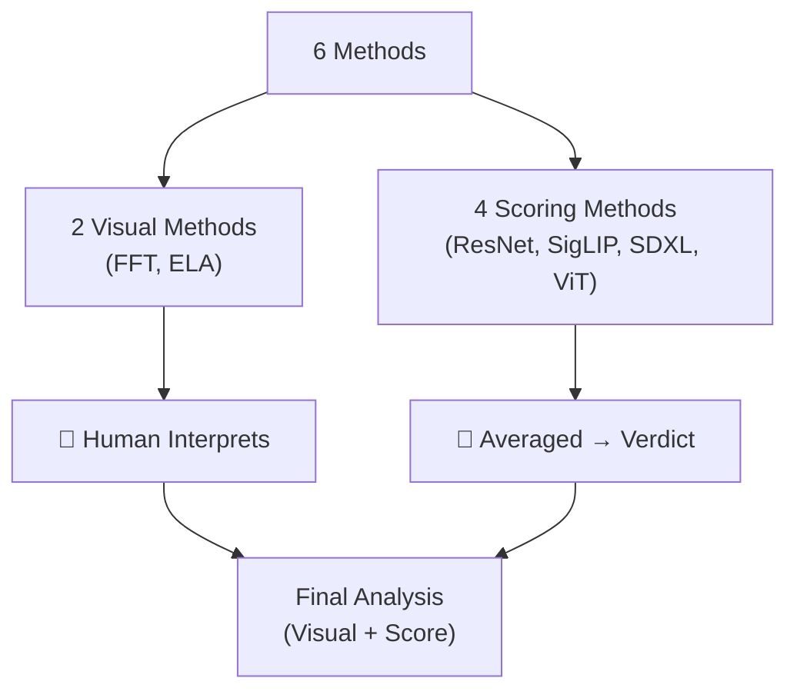

# 🔬 AI Image Detection — Complete Methods Guide

> **Purpose:** This document explains **every method** used in your graduation project so you can confidently answer any question your professor asks. Each section covers *what it is*, *the science behind it*, *exactly what your code does step-by-step*, *how to read the output*, and *possible questions & answers*.

---

## Table of Contents

1. [Project Overview — The Big Picture](#1-project-overview--the-big-picture)
2. [Preprocessing — What Happens Before Anything](#2-preprocessing--what-happens-before-anything)
3. [Method 1 — FFT (Fast Fourier Transform)](#3-method-1--fft-fast-fourier-transform)
4. [Method 2 — ELA (Error Level Analysis)](#4-method-2--ela-error-level-analysis)
5. [Method 3 — ResNet Model](#5-method-3--resnet-model-umm-maybeai-image-detector)
6. [Method 4 — SigLIP Model](#6-method-4--siglip-model-ateeqqai-vs-human-image-detector)
7. [Method 5 — SDXL Detector](#7-method-5--sdxl-detector-organiskasdxl-detector)
8. [Method 6 — ViT DeepFake Detector](#8-method-6--vit-deepfake-detector-prithivmlmodsdeep-fake-detector-v2-model)
9. [The Ensemble — How the Final Verdict Works](#9-the-ensemble--how-the-final-verdict-works)
10. [Quick-Reference Cheat Sheet](#10-quick-reference-cheat-sheet)

---

## 1. Project Overview — The Big Picture

Your project is an **AI-generated image detection system** that uses an **ensemble** (a team) of **six independent methods** to decide whether an uploaded image is **REAL** (taken by a camera) or **FAKE** (generated by AI such as Stable Diffusion, DALL·E, StyleGAN, etc.).



> [!IMPORTANT]
> **FFT and ELA are visual/forensic methods** — they produce images for a human to interpret. They do **NOT** contribute a numerical score to the final verdict.
> 
> **The 4 deep-learning models** each produce a probability score (0.0 to 1.0). These scores are **averaged** to produce the final verdict.

### Why Use Multiple Methods?

No single detector is perfect. Each method catches different types of artifacts:

| Method | What It Catches | Weakness |
|--------|----------------|----------|
| FFT | Repeating frequency patterns in AI synthesis | Can't detect semantically wrong content |
| ELA | Non-uniform compression regions (splicing) | Less effective on uncompressed PNGs |
| ResNet | Texture-level artifacts (CNNs are great at textures) | May miss global semantic inconsistencies |
| SigLIP | Semantic-level mismatch (language-image alignment) | Newer, less battle-tested |
| SDXL Detector | Diffusion-specific artifacts (noise schedule fingerprint) | Only trained on Stable Diffusion family |
| ViT DeepFake | Global attention patterns across full image | Larger model, slower inference |

---

## 2. Preprocessing — What Happens Before Anything

Before any analysis runs, every uploaded image goes through a **preprocessing pipeline** that cleans and prepares it.

### What Your Code Does (`preprocessing.py`):

```
Step 1: Open image → Convert to RGB (removes alpha channel if PNG)
Step 2: Strip EXIF/metadata (GPS, camera info, etc.) — prevents data leakage
Step 3: Create 3 versions:
        → (a) Grayscale NumPy array     → for FFT
        → (b) 90%-quality JPEG version  → for ELA
        → (c) Clean RGB PIL image        → for all 4 deep learning models
```

### Why Strip Metadata?

EXIF metadata can contain camera model info. A smart model could "cheat" by noticing that AI images have no EXIF data instead of actually analyzing pixel content. Stripping it forces all methods to look at the **actual pixels only**.

### Why Convert to Grayscale for FFT?

FFT analyzes frequency patterns — **texture and structure**. Color is irrelevant for this task. Working in grayscale is:
- Computationally cheaper (1 channel vs 3)
- Gives a cleaner frequency spectrum without color noise

### Why Create a 90% JPEG for ELA?

ELA needs to compare the original image against a **re-compressed** version. The differences reveal which parts were saved at different quality levels. More on this in the ELA section below.

---

## 3. Method 1 — FFT (Fast Fourier Transform)

### 🍎 The Simple Analogy

Imagine you're listening to music. The **waveform** (visualizer bars going up/down) shows you *time-domain* information — what's happening at each moment. But a **spectrum analyzer** (the equalizer display) shows you *frequency-domain* information — how much bass, mid, and treble there is overall.

**FFT does the same thing but for images instead of audio.** It converts an image from "which pixel is which color" (spatial domain) into "what repeating patterns exist" (frequency domain).

### 🔬 The Science

#### What Is a Frequency in an Image?

In an image:
- **Low frequencies** = smooth gradients, sky, blurry backgrounds, large uniform areas
- **High frequencies** = sharp edges, text, hair strands, fine texture details
- **Very specific frequencies** = repeating patterns at exact intervals (like a grid or checkerboard)

#### The Math (Simplified)

The 2D Discrete Fourier Transform takes every pixel value and decomposes it into a sum of 2D sine waves at different frequencies and orientations:

```
F(u,v) = Σ Σ f(x,y) · e^(-j2π(ux/M + vy/N))
```

Where:
- `f(x,y)` = pixel brightness at position (x,y)
- `F(u,v)` = how much of frequency (u,v) is present in the image
- `M × N` = image dimensions

**You do NOT need to memorize this formula.** What matters is the concept:

> FFT breaks the image into its component "frequencies" — like decomposing white light into a rainbow with a prism.

#### Why Fast Fourier Transform (FFT) Instead of Regular DFT?

The naive DFT has complexity **O(N⁴)** for an N×N image. FFT uses a clever divide-and-conquer algorithm (Cooley-Tukey, 1965) that reduces this to **O(N² log N)** — making it practical for real images.

### 🖥️ Step-by-Step: What Your Code Does

```python
# Step 1: Apply 2D FFT to the grayscale array
f = np.fft.fft2(grayscale_array)
# Result: Complex numbers representing amplitude + phase at each frequency

# Step 2: Shift zero-frequency to center
fshift = np.fft.fftshift(f)
# Why? By default, FFT puts low frequencies at corners. We shift so
# the center = low frequency, edges = high frequency. This is standard.

# Step 3: Calculate magnitude spectrum (log scale)
magnitude_spectrum = 20 * np.log(np.abs(fshift) + 1e-8)
# np.abs() gets the magnitude from complex numbers (ignoring phase)
# np.log() compresses the huge dynamic range so it's visible
# 20 * log is the same formula used for decibels in audio!
# 1e-8 prevents log(0) errors

# Step 4: Display as grayscale image
ax.imshow(magnitude_spectrum, cmap='gray')
```

### 🗺️ How to Read the FFT Output

The FFT produces a **grayscale "heatmap"** where:

```
                    ┌─────────────────────────┐
                    │                         │
                    │   High freq (fine       │
                    │   detail, noise, edges) │
                    │         ↑               │
                    │         │               │
                    │  ←── BRIGHT ──→         │
                    │  CENTER = LOW FREQ      │
                    │  (smooth areas)         │
                    │         │               │
                    │         ↓               │
                    │   High freq             │
                    │                         │
                    └─────────────────────────┘
```

#### Real Photo Characteristics:
- **Bright dot in the center** that **smoothly fades** outward in all directions
- The fade is roughly circular (isotropic = no single direction dominates)
- No sharp geometric patterns
- Looks like a "soft glow" or "flashlight pointing at you"

```
    ┌───────────────────┐
    │ . . . . . . . . . │
    │ . . . . . . . . . │
    │ . . . ░▒▓█▓▒░ . . │
    │ . . ░▒▓█████▓▒░ . │   ← REAL: smooth circular fade
    │ . . . ░▒▓█▓▒░ . . │
    │ . . . . . . . . . │
    │ . . . . . . . . . │
    └───────────────────┘
```

#### AI-Generated Image Characteristics:
- **Cross/star patterns** radiating from center (bright lines at 0°, 90°, or 45°)
- **Grid-like dots** at regular intervals
- **Bright spots at edges** (periodic artifacts from the generator's upsampling)
- Sharp geometric structures that look "unnatural"

```
    ┌───────────────────┐
    │ . . . █ . . . █ . │
    │ . . . █ . . . █ . │
    │ . . . █ . . . █ . │
    │ █ █ █ █ █ █ █ █ █ │   ← FAKE: grid/cross pattern
    │ . . . █ . . . █ . │
    │ . . . █ . . . █ . │
    │ . . . █ . . . █ . │
    └───────────────────┘
```

#### Why Do AI Images Show These Patterns?

AI generators (GANs, Diffusion Models) build images using mathematical operations:

1. **Upsampling layers** (transposed convolutions) in GANs create "checkerboard artifacts" — repeating patterns at the exact kernel size frequency
2. **Diffusion models** have a specific noise schedule that leaves fingerprints in certain frequency bands
3. **Tiling/padding** during generation creates perfectly periodic structures that never occur in nature

> **Nature is random and messy. Math is structured and periodic. FFT reveals this difference.**

### ❓ Possible Professor Questions

**Q: "Why use log scale?"**  
A: The DC component (center pixel, average brightness) can be millions of times larger than high-frequency components. Without log scaling, you'd see just one bright dot and everything else black. Log compresses this range so all frequencies are visible. The `20 * log` formula is the same one used for decibels in signal processing.

**Q: "Why shift to center?"**  
A: The raw FFT output places the zero-frequency (DC) component at the corners and high frequencies in the center, which is counterintuitive. `fftshift` rearranges it so low frequencies are centered and high frequencies are at the edges — this is the standard convention in image processing literature.

**Q: "Can FFT alone determine if an image is fake?"**  
A: Not with certainty. FFT is a *forensic clue*, not a classifier. Some AI images (especially newer diffusion models) have learned to minimize frequency artifacts. And some real images (like screenshots of pixel art) may have unusual frequency patterns. That's why we use it alongside other methods in an ensemble.

**Q: "What does the phase contain, and why do we ignore it?"**  
A: FFT produces complex numbers with both magnitude (how strong a frequency is) and phase (where the pattern is positioned). Magnitude tells us *what patterns exist*; phase tells us *where they are*. For detection, we care about *what* patterns exist, not where, so we use magnitude only.

---

## 4. Method 2 — ELA (Error Level Analysis)

### 🍎 The Simple Analogy

Imagine you photocopy a document, then photocopy the photocopy. The quality degrades. Now imagine someone pastes a freshly printed paragraph onto a twice-copied page and photocopies it again. The fresh paragraph will look **sharper** than everything else — it's been copied fewer times.

**ELA does this with JPEG compression.** By re-compressing an image and looking at what changed, we can find parts that were saved/compressed a different number of times — a sign of tampering or AI generation.

### 🔬 The Science

#### How JPEG Compression Works (Briefly)

JPEG works by:
1. Splitting the image into **8×8 pixel blocks**
2. Applying DCT (Discrete Cosine Transform) to each block
3. **Quantizing** (rounding) the frequency coefficients — this is where data is lost
4. Encoding the rounded values

At quality 90%, some fine details are lost. At quality 50%, more is lost. **Each re-compression loses more detail.**

#### The Key Insight

When you compress an image **at the same quality it was already saved at**, very little changes — the image has already "settled" at that quality level. But if part of the image was:

- **Never compressed before** (raw AI output or a pasted element) → it changes A LOT
- **Compressed at a different quality** → it changes differently from the rest

This difference in "how much each pixel changes" is what ELA measures.

#### The Formula

```
ELA_pixel = |Original_pixel - Recompressed_pixel| × Enhancement_Factor
```

For each pixel, we compute the absolute difference between the original image and the 90%-quality JPEG recompression. Then we amplify the differences to make them visible.

### 🖥️ Step-by-Step: What Your Code Does

```python
# PREPROCESSING (in preprocessing.py):
# The original image is saved to memory as 90% quality JPEG
buffer = io.BytesIO()
clean_img.save(buffer, format='JPEG', quality=90)
ela_jpeg_img = Image.open(buffer)

# ANALYSIS (in analyzers.py):
# Step 1: Calculate pixel-by-pixel difference
diff = ImageChops.difference(original_img, jpeg_img)
# For each pixel: diff = |original - recompressed|
# Most pixels will have small differences (0-17 range typically)

# Step 2: Enhance (amplify) the differences
ela_img = Image.eval(diff, lambda x: min(255, x * 15.0))
# Multiply each difference value by 15 to make it visible
# Cap at 255 (maximum pixel brightness)
# A difference of 1 becomes 15 (dark gray)
# A difference of 17 becomes 255 (pure white)
```

> [!NOTE]
> **Why multiply by 15 instead of auto-scaling?** In the training notebook, the code uses `max_diff` auto-scaling, but the web app uses a fixed `×15` multiplier. This is intentional — auto-scaling can be misleading because a single bright noise pixel would suppress everything else. A fixed multiplier gives consistent, comparable results across different images.

### 🗺️ How to Read the ELA Output

The ELA output is a color image where brightness indicates how much each pixel changed during recompression:

```
    ┌────────────────────────────────────────┐
    │  ████ BRIGHT/WHITE ████                │
    │  = This area changed A LOT             │
    │  = Was saved at a different quality     │
    │  = Possibly AI-generated or pasted     │
    │                                         │
    │  ░░░░ DARK/BLACK ░░░░                  │
    │  = This area barely changed            │
    │  = Was already at this compression     │
    │  = Consistent with a normal photograph │
    └────────────────────────────────────────┘
```

#### Real Photo Characteristics:
- **Uniform brightness** across the entire image — all parts react similarly because they were all captured and saved the same way
- Slight brightness along sharp edges (normal — edges always lose a tiny bit in JPEG)
- **No large regions** that are dramatically brighter than others

#### AI-Generated / Tampered Image Characteristics:
- **Non-uniform brightness** — some regions glow much brighter than others
- A person or face might glow brightly **while the background stays dark** (the face was generated/pasted separately)
- Blocky 8×8 grid patterns visible (JPEG artifacts from an earlier compression pass)
- Entire image glows uniformly bright = never been JPEG compressed before (raw AI output from PNG)

### ⚠️ Important Caveat for AI-Generated Images

Modern AI generators (like DALL·E, Midjourney) often output **PNG files** (lossless). If an image has **never been JPEG compressed before**, the ELA will actually show **uniform high brightness** across the entire image — because every pixel changes significantly during first-time compression. This looks like:

```
    Real photo (saved as JPEG before):     AI image (saved as PNG, never JPEG):
    ┌──────────────────────┐               ┌──────────────────────┐
    │ ░░░░░░░░░░░░░░░░░░░░ │               │ ████████████████████ │
    │ ░░░░░░░░░░░░░░░░░░░░ │               │ ████████████████████ │
    │ ░░░░░░░░░░░░░░░░░░░░ │               │ ████████████████████ │
    │ ░░░░░░░░░░░░░░░░░░░░ │               │ ████████████████████ │
    └──────────────────────┘               └──────────────────────┘
         Mostly dark                            Uniformly bright
```

Both types *could* indicate different things — this is why ELA alone is not conclusive.

### ❓ Possible Professor Questions

**Q: "Why quality 90%?"**  
A: 90% is the standard in ELA literature (Krawetz, 2007). It's high enough that it doesn't introduce too many of its own artifacts, but low enough to detect differences. Using 50% would change too much and mask the subtle differences we're looking for.

**Q: "What are the 8×8 blocks you mentioned?"**  
A: JPEG compresses images in independent 8×8 pixel blocks. When an image has been through multiple JPEG compressions, the block boundaries become visible in ELA as a faint grid pattern. This is actually evidence of double compression — which is suspicious.

**Q: "Can ELA detect AI images reliably?"**  
A: Not always. ELA was originally designed for **image forgery/splicing detection** (finding pasted regions). For AI images, it's more of a supporting clue. If the entire image was generated at once and saved as PNG, ELA will show uniform brightness (which is itself a subtle indicator). It works best when combined with other methods.

**Q: "What is `ImageChops.difference()`?"**  
A: It's a PIL (Pillow library) function that takes two images and produces a new image where each pixel = |image1_pixel - image2_pixel|. It computes the absolute difference channel by channel (R, G, B independently).

---

## 5. Method 3 — ResNet Model (`umm-maybe/AI-image-detector`)

### 🍎 The Simple Analogy

Imagine training a dog to sniff out counterfeit money. You show it thousands of real bills and thousands of fake bills until it learns the subtle texture differences. Now it can sniff a new bill and tell you if it's real or fake, even if it's a type of fake it hasn't seen before, because it learned the *general* texture patterns of counterfeiting.

**ResNet is the "trained dog" — but for images.** It was trained on thousands of real photographs and thousands of AI-generated images until it learned the subtle pixel-level patterns that distinguish them.

### 🔬 The Science

#### What Is ResNet?

**ResNet** (Residual Network) was introduced by **He et al. in 2015** in the paper *"Deep Residual Learning for Image Recognition"*. It won the ImageNet competition that year.

The key innovation is **skip connections** (residual connections):

```
Traditional Network:        ResNet:
Input → Layer → Output      Input ──→ Layer ──→ (+) → Output
                              │                  ↑
                              └──────────────────┘
                              (Skip Connection / Shortcut)
```

**Why does this matter?** In very deep networks (50+ layers), gradients become extremely tiny as they travel backward through the layers (vanishing gradient problem). The skip connection lets the gradient "jump over" layers, enabling effective training of networks with 50, 101, or even 152 layers.

#### ResNet-50 Architecture

The model used in your project is **ResNet-50** (50 layers deep):

```
Input Image (224×224×3)
    │
    ├── Conv Layer (7×7, stride 2) → 64 filters
    ├── Max Pool (3×3, stride 2)
    │
    ├── Residual Block ×3  (64 filters)     ← "conv2_x"
    ├── Residual Block ×4  (128 filters)    ← "conv3_x"
    ├── Residual Block ×6  (256 filters)    ← "conv4_x"
    ├── Residual Block ×3  (512 filters)    ← "conv5_x"
    │
    ├── Global Average Pooling
    ├── Fully Connected (512 → 2)
    └── Softmax → [P(real), P(fake)]
```

Each **Residual Block** contains:
```
Input → 1×1 Conv (reduce channels) → 3×3 Conv (process) → 1×1 Conv (restore channels) → (+Input) → ReLU
```

#### What Does Each Layer "See"?

```
Layer Depth:    What It Detects:
─────────────────────────────────────────
Layers 1-10     Edges, simple textures, color gradients
Layers 11-25    Texture patterns, repeated motifs, brush strokes
Layers 26-40    Object parts, face regions, composition patterns
Layers 41-50    High-level "fakeness" features (compression artifacts,
                GAN fingerprints, unnatural smoothness patterns)
```

The deeper layers learn increasingly abstract "fingerprints" of AI generation that humans can't even articulate.

#### The Specific Model: `umm-maybe/AI-image-detector`

- **Architecture:** ResNet-50 (pre-trained on ImageNet, fine-tuned for AI detection)
- **Training Data:** Real photographs (LSUN, COCO) vs AI-generated images (ProGAN, StyleGAN, diffusion models)
- **Output:** Two classes — `"human"` (real) and `"artificial"` (AI-generated)
- **Pre-training:** The model first learned general image features on ImageNet (1.2M images, 1000 classes), then was *fine-tuned* specifically for real vs. fake classification

#### What Is Transfer Learning?

Instead of training from scratch (which would require millions of images and weeks of GPU time), the model uses **transfer learning**:

```
Step 1: Train on ImageNet (1.2 million images) → learns edges, textures, objects
Step 2: Replace final layer (1000 classes → 2 classes: real/fake)
Step 3: Fine-tune on real vs. fake dataset → adapts existing knowledge to new task
```

This is like teaching a master painter to become an art forgery detective — they already understand brushstrokes, composition, and materials, so they just need to learn *what to look for*.

### 🖥️ Step-by-Step: What Your Code Does

```python
# Step 1: Load pre-trained model from Hugging Face
resnet_pipeline = pipeline("image-classification", model="umm-maybe/AI-image-detector")
# This downloads ~100MB of model weights (learned during training)
# The weights encode all the "knowledge" about real vs fake images

# Step 2: Feed image through the model
results = resnet_pipeline(image)
# Internally:
#   1. Resize image to 224×224
#   2. Normalize pixel values (using ImageNet mean/std)
#   3. Forward pass through 50 layers
#   4. Softmax at the end produces probabilities

# Step 3: Extract the "fake" probability
# results = [{'label': 'artificial', 'score': 0.87}, {'label': 'human', 'score': 0.13}]
for res in results:
    if res['label'].lower() in ['artificial', 'fake', 'ai']:
        fake_score = res['score']  # e.g., 0.87 = 87% confidence it's fake
```

### 📊 How to Interpret the Score

| Score | Meaning |
|-------|---------|
| 0.0 - 0.3 | Model is fairly confident the image is **REAL** |
| 0.3 - 0.5 | Model is **uncertain** — could be either |
| 0.5 - 0.7 | Model leans toward **FAKE** but not very confident |
| 0.7 - 1.0 | Model is fairly to very confident the image is **FAKE** |

### ❓ Possible Professor Questions

**Q: "What are residual connections and why are they important?"**  
A: They are shortcut connections that add the input of a block directly to its output (F(x) + x instead of just F(x)). This solves the vanishing gradient problem, allowing networks to be much deeper. Without them, a 50-layer network would actually perform *worse* than a 20-layer one.

**Q: "What is the softmax function?"**  
A: Softmax converts raw network outputs (logits) into a probability distribution. For two classes: `P(fake) = e^z_fake / (e^z_fake + e^z_real)`. The outputs always sum to 1.0, making them interpretable as probabilities.

**Q: "Did you train this model?"**  
A: No, we used a **pre-trained model** from Hugging Face (`umm-maybe/AI-image-detector`). This is transfer learning — the model was trained by others on large datasets. We use it for inference (prediction) only.

**Q: "What if the model encounters an AI generator it wasn't trained on?"**  
A: ResNet learns generalizable texture features (unnatural smoothness, weird edge patterns) rather than memorizing specific generators. It can often detect unseen generators, but accuracy may drop. This is why we use an ensemble of multiple models.

---

## 6. Method 4 — SigLIP Model (`Ateeqq/ai-vs-human-image-detector`)

### 🍎 The Simple Analogy

Imagine someone who studied art history for years and can look at a painting and say "this doesn't *feel* right — the lighting contradicts the shadow direction, and the texture of the skin is inconsistent with the style of the background." They're using **semantic understanding** — understanding the *meaning* of what they see, not just the pixels.

**SigLIP is like that art expert.** It was trained to understand images at a deep semantic level by aligning visual concepts with language concepts.

### 🔬 The Science

#### What Is SigLIP?

**SigLIP** stands for **Sigmoid Language-Image Pre-training**. It's a variant of OpenAI's **CLIP** (Contrastive Language-Image Pre-training) developed by Google.

The core idea of CLIP/SigLIP is to train a model that understands images **through language**:

```
Training Data: 400 million (image, text caption) pairs from the internet

Image: [photo of a dog]  ←──match──→  Text: "a golden retriever playing in a park"
Image: [photo of a car]  ←──match──→  Text: "red sports car on a highway"
```

The model learns to place images and their matching text descriptions **close together** in a shared mathematical space (called an embedding space), and non-matching pairs far apart.

#### How SigLIP Differs from CLIP

```
CLIP uses:   Softmax contrastive loss (normalize across batch)
SigLIP uses: Sigmoid contrastive loss (independent per pair)
```

**Why Sigmoid?** Softmax forces the model to compare each image against ALL texts in a batch simultaneously, which is computationally expensive and requires large batches. Sigmoid treats each image-text pair independently (is this a match? yes/no), allowing:
- More efficient training
- Better performance on smaller batch sizes
- Improved accuracy on fine-grained tasks

#### How Is SigLIP Used for AI Detection?

After pre-training on image-text pairs, the SigLIP model is **fine-tuned** for binary classification (real vs. AI). The process:

```
Pre-trained SigLIP (understands images semantically)
    │
    ├── Remove original text encoder
    ├── Keep image encoder (ViT backbone)
    ├── Add classification head (→ 2 classes)
    │
    └── Fine-tune on real vs. AI dataset
         Result: Model that uses semantic understanding
         to detect "something is off" about AI images
```

#### What Makes SigLIP Different from ResNet for Detection?

| Feature | ResNet | SigLIP |
|---------|--------|--------|
| **Approach** | Bottom-up texture analysis | Top-down semantic analysis |
| **Detects** | Pixel-level artifacts, textures | Conceptual inconsistencies, unnatural compositions |
| **Architecture** | CNN (local patterns → global) | Vision Transformer (global context from start) |
| **Pre-training** | ImageNet (object classification) | Image-text pairs (semantic understanding) |

SigLIP might catch things like:
- "The reflection in the eyes doesn't match the environment"
- "The skin texture is unnaturally smooth and uniform"
- "The background is semantically inconsistent with the subject"

### 🖥️ What Your Code Does

```python
# Identical pipeline pattern as ResNet — Hugging Face abstracts the differences
siglip_pipeline = pipeline("image-classification", model="Ateeqq/ai-vs-human-image-detector")
results = siglip_pipeline(image)

# Extract score — same logic as ResNet
for res in results:
    if res['label'].lower() in ['artificial', 'fake', 'ai', 'ai generated']:
        fake_score = res['score']
```

The code looks identical because the Hugging Face `pipeline` API abstracts the model architecture. Internally, the image goes through a completely different architecture (ViT-based instead of CNN-based), but the input/output format is the same.

### ❓ Possible Professor Questions

**Q: "What is contrastive learning?"**  
A: It's a training technique where the model learns by comparing pairs: "these two things should be similar" vs "these two things should be different." In SigLIP, matching image-text pairs should produce high similarity scores, and non-matching pairs should produce low scores.

**Q: "What does 'embedding space' mean?"**  
A: It's a high-dimensional mathematical space (e.g., 768 dimensions) where each image or text is represented as a point (vector). Similar concepts cluster together. Think of it as a map where "cat" and "kitten" are nearby, but "cat" and "airplane" are far apart.

**Q: "Why include SigLIP when you already have ResNet?"**  
A: They use fundamentally different approaches. ResNet is a CNN that analyzes local textures bottom-up. SigLIP is a Vision Transformer that captures global semantic relationships. They catch different types of artifacts, making the ensemble more robust.

---

## 7. Method 5 — SDXL Detector (`Organika/sdxl-detector`)

### 🍎 The Simple Analogy

If ResNet is a general counterfeit detector and SigLIP is an art expert, then the **SDXL Detector is a specialist** who specifically studied one counterfeiter's techniques. It's trained to recognize the specific "fingerprints" left by the **Stable Diffusion XL** family of generators.

### 🔬 The Science

#### What Is Stable Diffusion XL (SDXL)?

SDXL is one of the most popular AI image generators (by Stability AI). It uses a **diffusion process**:

```
Forward Process (Training):
Clean Image → Add noise → Add noise → ... → Pure Random Noise
                                              (Gaussian noise)

Reverse Process (Generation):
Pure Random Noise → Remove noise → Remove noise → ... → Clean Image
              (the model learns to reverse the process)
```

The model (a U-Net) learns to predict and remove noise at each step. After ~50 denoising steps, you get a sharp, realistic image.

#### What Artifacts Does SDXL Leave Behind?

Even though SDXL generates incredibly realistic images, it leaves subtle fingerprints:

1. **Noise Schedule Fingerprint:** The specific pattern of how noise is added/removed is unique to SDXL. The resulting pixel statistics differ slightly from natural photos.

2. **VAE Artifacts:** SDXL works in a compressed "latent space" (lower resolution) and upsamples at the end using a VAE (Variational Autoencoder). This upsampling can leave subtle artifacts at specific frequency bands.

3. **Attention Pattern Artifacts:** The model uses cross-attention between text prompts and image features. This creates characteristic patterns in how different image regions relate to each other.

4. **Latent Space Grid:** SDXL processes images at 1/8th resolution internally, then upscales. This creates a subtle 8×8 grid structure similar to (but different from) JPEG artifacts.

#### How the Detector Works

The SDXL Detector is a fine-tuned image classifier specifically trained on:
- **Real images** from photography datasets
- **SDXL-generated images** from various prompts and settings

It learns the specific statistical fingerprints of the SDXL generation pipeline.

### 🖥️ What Your Code Does

```python
sdxl_pipeline = pipeline("image-classification", model="Organika/sdxl-detector")
results = sdxl_pipeline(image)
# Same extraction logic for the fake score
```

### ❓ Possible Professor Questions

**Q: "What is a diffusion model?"**  
A: A diffusion model learns to generate images by learning to reverse a noise-adding process. During training, it sees clean images progressively corrupted with Gaussian noise and learns to denoise them. During generation, it starts from pure noise and iteratively removes noise to create an image.

**Q: "Why have a separate detector for SDXL?"**  
A: Different AI generators leave different fingerprints. A general detector might miss artifacts specific to one generator. SDXL is currently the most popular open-source generator, so having a specialist detector for it increases our chances of catching SDXL-generated images.

**Q: "What if the image was generated by Midjourney or DALL·E instead of SDXL?"**  
A: The SDXL detector might give lower confidence for non-SDXL images. However, many diffusion models share similar architectures, so it may still detect some artifacts. The other models in our ensemble (ResNet, SigLIP, ViT) are more general-purpose and can compensate.

**Q: "What is a VAE?"**  
A: A Variational Autoencoder consists of an encoder (compresses image → small latent code) and a decoder (expands latent code → full image). SDXL works in this compressed latent space for efficiency, then uses the decoder to produce the final image. The decoder's upsampling can introduce subtle artifacts.

---

## 8. Method 6 — ViT DeepFake Detector (`prithivMLmods/Deep-Fake-Detector-v2-Model`)

### 🍎 The Simple Analogy

While ResNet (a CNN) looks at an image like reading a book **word by word** (analyzing small local patches and gradually combining them), the **Vision Transformer (ViT)** looks at the image like seeing the **entire page at once** and understanding how all parts relate to each other simultaneously.

### 🔬 The Science

#### What Is a Vision Transformer (ViT)?

ViT was introduced by **Dosovitskiy et al. (2020)** in *"An Image Is Worth 16×16 Words"*. It applies the **Transformer architecture** (originally designed for language/NLP by Vaswani et al., 2017) directly to images.

#### How ViT Processes an Image:

```
Step 1: Split image into patches (like puzzle pieces)
┌────┬────┬────┬────┐
│ P1 │ P2 │ P3 │ P4 │     Image (224×224) → 196 patches of 16×16
├────┼────┼────┼────┤     Each patch is treated as a "word" in a sentence
│ P5 │ P6 │ P7 │ P8 │
├────┼────┼────┼────┤
│ P9 │P10 │P11 │P12 │
├────┼────┼────┼────┤
│P13 │P14 │P15 │P16 │
└────┴────┴────┴────┘

Step 2: Flatten each patch into a vector
P1 = [0.12, 0.45, 0.89, ...] (768 dimensions)

Step 3: Add positional encoding (so the model knows WHERE each patch is)
P1 + Pos1, P2 + Pos2, ...

Step 4: Add a special [CLS] token (classification token)
[CLS], P1, P2, ..., P196  (197 tokens total)

Step 5: Feed through Transformer Encoder (12 layers of self-attention)

Step 6: Use [CLS] output for classification → real or fake
```

#### The Key: Self-Attention Mechanism

The **self-attention** mechanism is what makes ViT powerful. It lets every patch "look at" every other patch and learn relationships:

```
For each patch, attention computes:
"How much should I pay attention to every other patch?"

         P1    P2    P3    P4
P1     [0.1,  0.7,  0.1,  0.1]   ← P1 mostly attends to P2
P2     [0.3,  0.2,  0.4,  0.1]   ← P2 mostly attends to P3
P3     [0.1,  0.1,  0.2,  0.6]   ← P3 mostly attends to P4
P4     [0.5,  0.1,  0.1,  0.3]   ← P4 mostly attends to P1
```

This means the model can learn that:
- "The lighting on the face (patch P5) should be consistent with the shadow on the wall (patch P14)"
- "The eye reflection (patch P3) should match the light source visible in (patch P16)"

**AI-generated images often fail these global consistency checks.**

#### ViT vs CNN (ResNet): Key Differences



| Aspect | CNN (ResNet) | ViT |
|--------|-------------|-----|
| **Receptive field** | Starts small, grows with depth | Global from layer 1 |
| **Spatial bias** | Strong (assumes nearby pixels are related) | None (learns relationships from data) |
| **Data requirements** | Works well with less data | Needs more data (no built-in spatial assumptions) |
| **Strengths** | Texture patterns, local artifacts | Global consistency, long-range relationships |

#### Why Use ViT for DeepFake Detection?

DeepFakes and AI images often have:
- **Local** artifacts (handled well by ResNet)
- **Global** inconsistencies (handled well by ViT)

Examples of global inconsistencies ViT can catch:
- Mismatched lighting across the image
- Inconsistent perspective (one object seems to be from a different viewpoint)
- Unnatural relationships between foreground and background
- Symmetry artifacts in faces (AI tends to make faces too symmetric)

### 🖥️ What Your Code Does

```python
deepfake_pipeline = pipeline("image-classification", 
                             model="prithivMLmods/Deep-Fake-Detector-v2-Model")
results = deepfake_pipeline(image)
# Same extraction logic — Hugging Face makes the API uniform
```

### ❓ Possible Professor Questions

**Q: "What is self-attention?"**  
A: Self-attention is a mechanism where each element in a sequence computes attention weights over all other elements. For each element, it computes Query (what am I looking for?), Key (what do I contain?), and Value (what information do I provide). The attention score between two elements is: `Attention(Q,K,V) = softmax(QK^T / √d_k) × V`. This lets the model learn which parts of the image are relevant to each other.

**Q: "What is the [CLS] token?"**  
A: It's a special learnable token prepended to the patch sequence. During training, this token learns to aggregate information from all patches through self-attention. Its final representation is used as the "summary" of the entire image for classification.

**Q: "What are positional encodings?"**  
A: Since Transformers process all inputs in parallel (unlike RNNs which process sequentially), they have no inherent notion of order/position. Positional encodings are vectors added to each patch embedding that encode spatial position (e.g., "this patch comes from row 3, column 5"). Without these, the model couldn't distinguish a horizontally flipped image from the original.

**Q: "Why is this called Deep-Fake-Detector-v2?"**  
A: It's the second version of this particular model, suggesting improved training data, architecture, or fine-tuning compared to v1. The "DeepFake" in the name reflects its focus on detecting synthetically generated faces and images.

---

## 9. The Ensemble — How the Final Verdict Works

### The Logic

```python
# Average the 4 deep-learning model scores
average_score = (resnet + siglip + sdxl + deepfake) / 4.0

# Decision threshold at 0.5
if average_score > 0.5:
    verdict = "FAKE"        # with confidence = average_score × 100
else:
    verdict = "REAL"        # with confidence = (1 - average_score) × 100
```

### Why Average? Why Not Something Fancier?

| Ensemble Method | Pros | Cons |
|----------------|------|------|
| **Simple Average** ✅ (what your project uses) | Easy to understand, no extra training needed, robust | Treats all models equally |
| Weighted Average | Can give better models more influence | Needs to determine weights somehow |
| Majority Voting | Democratic, ignores outliers | Loses probability information |
| Stacking (Meta-learner) | Learns optimal combination | Requires its own training data |

Simple averaging is a solid, defensible choice because:
1. No risk of overfitting the ensemble itself
2. Easy to explain and debug
3. Research shows simple averaging often performs comparably to more complex methods

### Why Only 4 Models (Not 6)?

FFT and ELA produce **visual outputs** (images), not numerical scores. They are meant for **human interpretation** — a security analyst looking at the results can use FFT and ELA as additional evidence. The 4 Deep Learning models produce standardized probability scores that can be mathematically combined.



### ❓ Possible Professor Questions

**Q: "Why is the threshold 0.5?"**  
A: 0.5 is the natural decision boundary when averaging probabilities. If the average "fake" probability across 4 models exceeds 50%, more evidence points toward fake than real. In production, you might adjust this threshold based on the cost of false positives vs false negatives.

**Q: "What if 3 models say REAL (score ~0.1) and 1 model says FAKE (score ~0.95)?"**  
A: Average = (0.1 + 0.1 + 0.1 + 0.95) / 4 = 0.3125 → Verdict: REAL. The three confident "REAL" scores outweigh the one "FAKE" score. This is a feature of averaging — it's resistant to a single model being wrong.

**Q: "Could you improve the ensemble?"**  
A: Yes, several approaches:
1. Use a weighted average based on each model's individual accuracy on a validation set
2. Train a meta-classifier (stacking) that learns the optimal combination
3. Add confidence-based weighting (trust high-confidence predictions more)
4. Use anomaly detection to flag when models disagree strongly

---

## 10. Quick-Reference Cheat Sheet

Use this to quickly remind yourself before the discussion:

```
┌─────────────────────────────────────────────────────────────────────┐
│                     METHOD CHEAT SHEET                              │
├─────────────┬───────────────────────────────────────────────────────┤
│ FFT         │ Converts image to frequency domain                   │
│             │ Shows WHAT repeating patterns exist                   │
│             │ Real = smooth circular glow from center               │
│             │ Fake = grid lines, cross patterns, bright spots       │
│             │ ⚠️ Visual only — no score for ensemble                │
├─────────────┼───────────────────────────────────────────────────────┤
│ ELA         │ Re-compress at 90% JPEG, diff with original          │
│             │ Shows areas saved at inconsistent quality levels      │
│             │ Real = uniform darkness (consistent compression)      │
│             │ Fake = bright spots, non-uniform glow                 │
│             │ ⚠️ Visual only — no score for ensemble                │
├─────────────┼───────────────────────────────────────────────────────┤
│ ResNet      │ CNN (50 layers), texture-level analysis               │
│             │ Trained on real photos vs AI images                   │
│             │ Key innovation: skip connections                      │
│             │ Output: P(fake) from 0.0 to 1.0                      │
│             │ ✅ Score goes to ensemble                              │
├─────────────┼───────────────────────────────────────────────────────┤
│ SigLIP      │ Vision Transformer, semantic-level analysis           │
│             │ Pre-trained with language-image alignment              │
│             │ Understands image "meaning", not just textures        │
│             │ Output: P(fake) from 0.0 to 1.0                      │
│             │ ✅ Score goes to ensemble                              │
├─────────────┼───────────────────────────────────────────────────────┤
│ SDXL Det.   │ Specialist for Stable Diffusion XL family             │
│             │ Detects VAE artifacts, noise schedule fingerprints    │
│             │ Strongest on SDXL-generated images                    │
│             │ Output: P(fake) from 0.0 to 1.0                      │
│             │ ✅ Score goes to ensemble                              │
├─────────────┼───────────────────────────────────────────────────────┤
│ ViT DeepF.  │ Vision Transformer, global consistency analysis       │
│             │ Catches lighting/perspective inconsistencies          │
│             │ 16×16 patches + self-attention                        │
│             │ Output: P(fake) from 0.0 to 1.0                      │
│             │ ✅ Score goes to ensemble                              │
├─────────────┼───────────────────────────────────────────────────────┤
│ ENSEMBLE    │ Average of 4 model scores                             │
│             │ Threshold: > 0.5 = FAKE, ≤ 0.5 = REAL               │
│             │ Confidence = distance from threshold × 100            │
└─────────────┴───────────────────────────────────────────────────────┘
```

### Key Terms to Know

| Term | Definition |
|------|-----------|
| **Ensemble** | Combining multiple models/methods to get a more robust prediction |
| **Transfer Learning** | Taking a model trained on one task and adapting it for another |
| **Fine-tuning** | Continuing to train a pre-trained model on new, specific data |
| **Inference** | Using a trained model to make predictions (no learning, just predicting) |
| **Pipeline** | Hugging Face API that wraps model loading, preprocessing, and inference in one call |
| **Softmax** | Function that converts raw numbers into probabilities that sum to 1 |
| **Magnitude Spectrum** | Visual representation of which frequencies are present in an image |
| **JPEG Quantization** | The lossy step in JPEG compression where fine details are rounded/discarded |
| **Self-Attention** | Mechanism where each element learns relationships to all other elements |
| **Skip Connection** | Shortcut that lets data bypass layers, enabling deeper networks |
| **Latent Space** | Compressed mathematical representation of data (used by VAE/diffusion models) |
| **Gaussian Noise** | Random noise following a bell-curve distribution (fundamental to diffusion models) |

---

> [!TIP]
> **Discussion Strategy:** When your professor asks about a method, start with the **analogy** (shows intuition), then give the **technical explanation** (shows understanding), and finally mention **the limitation** (shows critical thinking). This demonstrates deep understanding beyond just memorization.

> [!TIP]
> **If you're asked about something you don't know:** Say "That's beyond the scope of what we implemented, but my understanding is that..." — it shows intellectual honesty and maturity.
